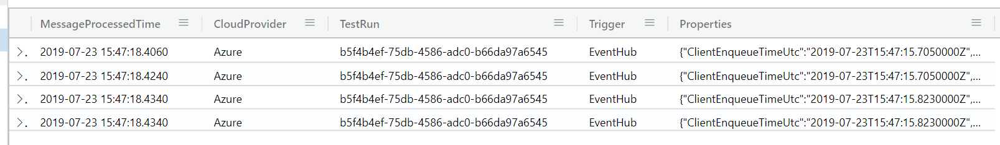

# Produce & Consume messages through Service Bus, Event Hubs, and Storage Queues with Durable Functions

This sample shows how to utilize Durable Functions' fan out pattern to load an arbitrary number of messages across any number of sessions/partitions in to Service Bus, Event Hubs, or Storage Queues. It also adds the ability to consume those messages with another Azure Function and load the resulting timing data in to another Event Hub for ingestion in to analytics services like Azure Data Explorer.

> **Note**: Please use the `sample.local.settings.json` file as the baseline for `local.settings.json` when testing this sample locally.

## Service Bus

```http
POST /api/PostToServiceBusQueue HTTP/1.1
Content-Type: application/json
cache-control: no-cache

{
  "NumberOfSessions": 2,
  "NumberOfMessagesPerSession": 2
}
```

Will post two messages across two sessions to the Service Bus queue specified by the `ServiceBusConnection` and `ServiceBusQueueName` settings in your `local.settings.json` file or - when published to Azure - the Function App's application settings.

## Event Hubs

```http
POST /api/PostToEventHub HTTP/1.1
Content-Type: application/json
cache-control: no-cache

{
  "NumberOfMessagesPerPartition": 2
}
```

Will post two messages across per partition to the Event Hub specified by the `EventHubConnection` and `EventHubName` settings in your `local.settings.json` file or - when published to Azure - the Function App's application settings.

The number of messages per partition will differ by no more than 1.

## Storage Queues

```http
POST /api/PostToStorageQueue HTTP/1.1
Content-Type: application/json
cache-control: no-cache

{
  "NumberOfMessages": 2
}
```

Will post two messages to the Storage Queue specified by the `StorageQueueConnection` and `StorageQueueName` settings in your `local.settings.json` file or - when published to Azure - the Function App's application settings.

## Implementation

### Fan out/in

This sample utilizes [Durable Functions fan out/in pattern](https://docs.microsoft.com/en-us/azure/azure-functions/durable/durable-functions-cloud-backup) to produce messages in parallel across the sessions/partitions you specify. For this reason, pay close attention to [the `DFTaskHubName` application setting](Producer/sample.local.settings.json) if you put it in the same Function App as other Durable Function implementation.

### Message content

The content for each message is **not** dynamic at this time. It is simply stored in the [messagecontent.txt](Producer/messagecontent.txt) file and posted as the content for each message in every scenario. If you wish to make the content dynamic, you can do so by changing the code in each scenario's `Functions.cs` file of the `Producer` project.

## Demo

This project comes out of a customer engagement whereby we wanted to see how long it would take messages loaded in to a Service Bus queue across thousands of sessions to be processed in FIFO order per session.

### Deploy to Azure
You can deploy the solution in this repo directly to Azure by simply executing `deploy.ps1` from PowerShell. You'll need to have [Azure PowerShell installed](https://docs.microsoft.com/en-us/powershell/azure/install-az-ps?view=azps-2.4.0#install-the-azure-powershell-module-1) and your Azure Subscription ID handy. Upon completion, your subscription will have a new Resource Group (you'll name this when you execute `deploy.ps1`) with:

* Service Bus **Standard** namespace with a `sample` queue
* Event Hub **Basic** namespace
  * A `collector` hub w/ 32 partitions - this is where each consumer posts messages when they consume from their source
  * A `sample` hub with 32 partitions - this is where the Producer will post messages for the EH scenario
* Azure Data Explorer **Dev** instance ingesting data from the above Event Hub
* Azure Storage instance for use by the Durable Functions and the Storage Queue producer/consumer paths (`sample` queue created)
* 1 Azure Function app with the Producer Function code
  * Application settings set to the connection strings of the Service Bus, Event Hub, and Azure Storage
* 1 Azure Function app with the Consumer Function code
  * Application settings set to the connection strings of the Service Bus, Event Hub, and Azure Storage

> Note: The deployment script sets up an initial deploy from GitHub to the created Function Apps. If you wish to change any behavior of this sample, you will need to manually publish your changes _after_ first deploying the sample. Additionally, any subsequent executions of `deploy.ps1` will reset the code to the state of `master` in this repo.

Upon successful deployment you'll be given the HTTP POST URLs for each of the Producer endpoints. Using the sample payloads earlier in this Readme, you'll get a response like:

```json
{
    "TestRunId": "b5f4b4ef-75db-4586-adc0-b66da97a6545"
}
```

Then, head to your Data Explorer (the window you ran queries within during deployment) and execute the following query to see the results of your run:

```
SampleDataTable
```

> Note: It can take up to 5 minutes for data to be ingested & show up in Azure Data Explorer

to retrieve all of the rows in the ingestion table. You should then see something like this:


You can use the content of `Properties` to get more detailed data. Try this query:

```kusto
SampleDataTable
| extend Duration = make_timespan(MessageProcessedTime - Properties.ClientEnqueueTimeUtc)
| summarize AvgIndividualProcessTime = avg(Duration), RunStartTime = min(make_datetime(Properties.ClientEnqueueTimeUtc)), RunEndTime = max(MessageProcessedTime) by TestRun, Trigger
| extend TotalRuntime = (RunEndTime - RunStartTime)
| project-away RunStartTime, RunEndTime
```

This will show you the average processing time for an individual message in the test run, and then the overall time for the entire test run to complete. You can limit to a specific test run by adding a `where` filter:

```kusto
SampleDataTable
| where TestRun = 'b5f4b4ef-75db-4586-adc0-b66da97a6545'
| extend Duration = make_timespan(MessageProcessedTime - Properties.ClientEnqueueTimeUtc)
| summarize AvgIndividualProcessTime = avg(Duration), RunStartTime = min(make_datetime(Properties.ClientEnqueueTimeUtc)), RunEndTime = max(MessageProcessedTime) by TestRun, Trigger
| extend TotalRuntime = (RunEndTime - RunStartTime)
| project-away RunStartTime, RunEndTime
```
